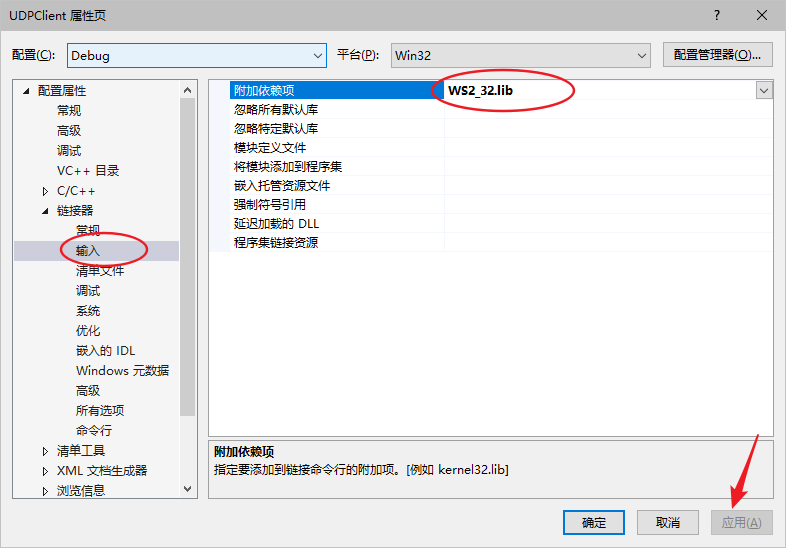
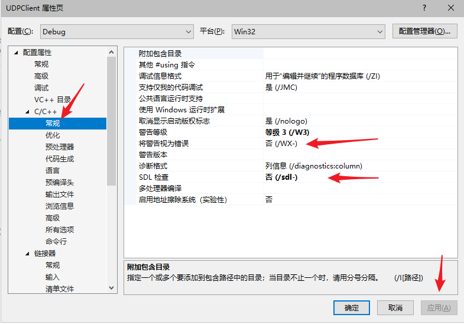
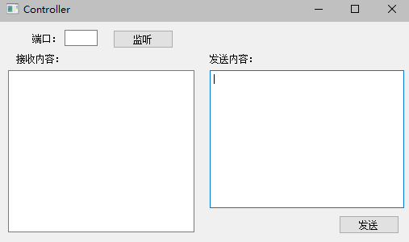
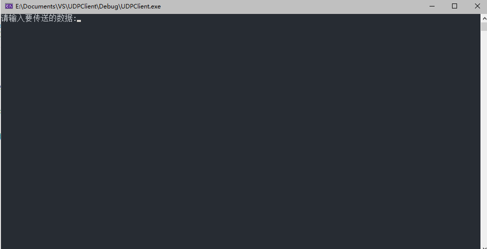
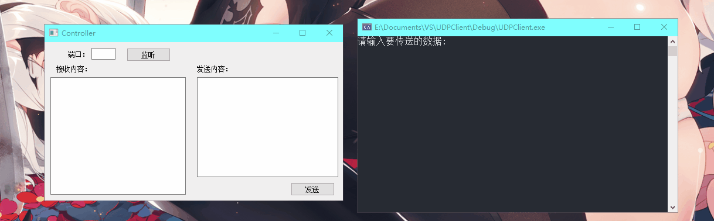

1.  # 计算机网络UDP

    #### 介绍

    计算机网络udp，使用qt制作

    #### 软件架构

    使用winsocket和Qt制作


    #### 安装教程

    1.  qt使用winsocket

        在pro文件中加入

        ```
        LIBS += -lWs2_32
        ```

    2.  vs使用

        右键项目

        添加ws2_32.lib依赖

        

        去除c++警告

        

    #### 使用说明

    1.  应用截图

        服务端

        

        客户端

        

    

    2.  使用

    

    

    
